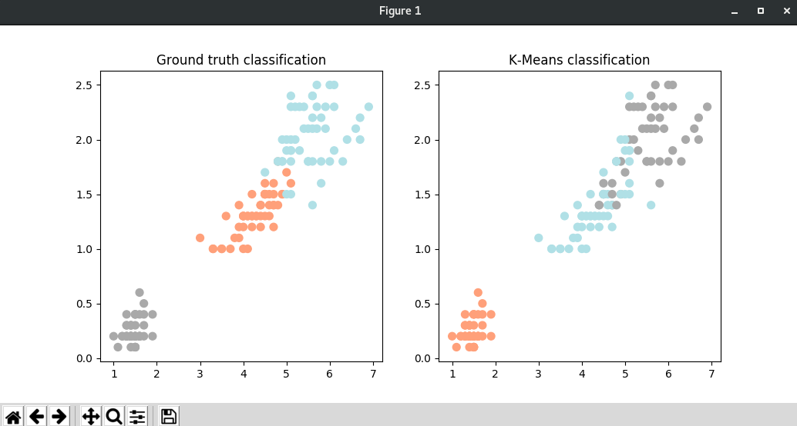

# K-means demo applicatie

K-means is een cluster-algoritme die bepaalde punten kan clusteren. Met het k-means algoritme kan de programmeur zelf aangeven hoeveel clusters hij of zij wenst.


## Vereisten

Het prototype is gebouwd en getest op 64-bits Windows- en 64-bits Linux-systemen om de werking van de code te verifiëren.

Voor deze demo dienen een aantal zaken geïnstalleerd te zijn op de omgeving waarin deze demo wordt uitgevoerd.

- Python versie 3.6 	(https://www.python.org/downloads/release/python-364/)
- Pip versie 10.0  		(https://pip.pypa.io/en/stable/installing/)


## Installatie

Om de programmacode te draaien heb je de volgende Python-modulen nodig:

- numpy (voor het aanleveren van een functie om een array te maken);
- pandas (voor het vergemakkelijken met het werken met data. Pandas wordt in de demo gebruikt om een structuur te maken van de aangeleverde dataset, zodat het gemakkelijker is om hiervan een plot te maken);
- matplotlib (voor het creëeren van de plots).
- sklearn (voor het aanleveren van de dataset voor de demo en functies om machine learning mogelijk te maken)

Door het commando `pip install -r requirements.txt --user` uit te voeren in een opdrachtvenster worden alle modules in één keer gedownload.


## Data

De dataset wordt aangeleverd door scikit-learn, een open-source machine-learning module voor Python, die beschikt over verschillende classificatie-, regressie- en clusteringalgoritmen.
De demo gebruikt de iris-dataset van scikit-learn, een gemakkelijk te gebruiken multi-class classification dataset.


## Demo code

```python
# Importeer de modulen
import numpy as np
import pandas as pd

import matplotlib.pyplot as plt
from sklearn.cluster import KMeans
from sklearn.preprocessing import scale

from sklearn import datasets

iris = datasets.load_iris()
x = scale(iris.data)

# Maak het model
clustering = KMeans(n_clusters=3, random_state=5)
clustering.fit(x)

# Plot de uitkomst van het model
iris_df = pd.DataFrame(iris.data)
iris_df.columns = ['Sepal_Length',
               	'Sepal_Width', 'Petal_Length', 'Petal_Width']
color_theme = np.array(['darkgray', 'lightsalmon', 'powderblue'])

# Maak het Ground truth classification plot
plt.subplot(1, 2, 1)
plt.scatter(x=iris_df.Petal_Length, y=iris_df.Petal_Width,
        	c=color_theme[iris.target], s=50)

plt.title('Ground truth classification')

# Maak het K-Means plot
plt.subplot(1, 2, 2)
plt.scatter(x=iris_df.Petal_Length, y=iris_df.Petal_Width,
        	c=color_theme[clustering.labels_], s=50)
plt.title('K-Means classification')

plt.show()
```


### Applicatie resultaat



De resultaten van de code staan in de bovenstaande diagrammen. Het linker diagram is gebaseerd op de ground truth classification. De ground truth classification is de benaming voor de resultaten die gegeven zijn door de dataset en dus 100% kloppen. Het rechter diagram is gebaseerd op het model wat het k-means algoritme gebruikt. Zoals te zien is worden bepaalde punten bij elkaar gegroepeerd. Deze groepen worden met elkaar onderscheiden door de kleur. Elk kleurtje is een andere groep. Er valt te zien dat het verschil tussen de ground truth classification en de k-means classification is dat bepaalde punten eigenlijk bij een andere groep horen. Zo zie je dat je bij de k-means classification en ground truth classification er bij de punten in het midden en rechtsboven een verschil is in welke groep het zit.

Het k-means algoritme is niet bruikbaar omdat het geen ziekte kan retourneren die gebaseerd is op de dataset die je levert.

- K-means werkt zonder gelabelde data, onze data is sowieso gelabeld
- K-means kan voor onze casus geen gewenst resultaat (een ziekte) retourneren.